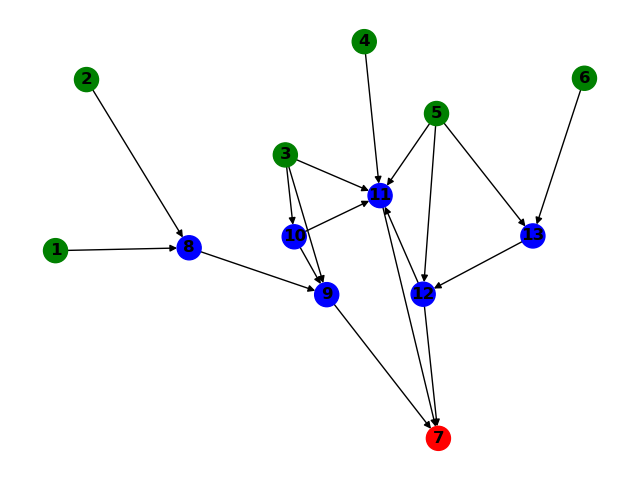
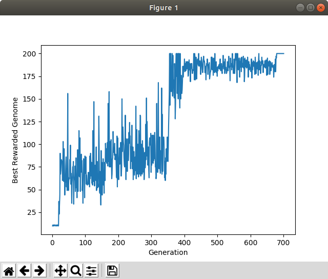

## Evolving Neural Networks

[](https://travis-ci.com/oneturkmen/evolving-nets)
 

### About

There is a traditional way to optimize neural network's weights - through backpropagation and gradient descent. Though it is quite effective in terms of locating optima, it does not always end up in a global optima (which we may wish for certain, complex tasks). However, metaheuristics (including evolutionary algorithms) are very good in terms of finding a global optimum, especially for tasks with very variable, noisy fitness landscapes. 

Here, I will use Neuroevolution of Augmenting Topologies (NEAT), which optimizes neural network's weights as well as its topology [1]. It is implemented from scratch and is tested it with an OpenAI gym environment called balancing a cart pole.

### Usage

Python3 required along with packages specified in `requirements.txt` file.

Install dependencies:

```bash
python3 install -U -r requirements.txt
```

Run NEAT:

```bash
python3 neat/src/main.py
```

Or, run fixed-topology neural network optimization process:

```bash
python3 fixed-topology-ne/main.py
```

### Example of non-dense neural network architecture

**NOTE:** This was not generated by NEAT. The image was generated during the testing of visualization process.



### Performance of a genetic algorithm optimizing fixed topology NN



### Features

- [x] Reusable implementation fixed-topology network and its evolution (e.g. for balancing a cart pole from OpenAI gym).
- [x] Reusable implementation of NEAT with all its operators, such as mutation and crossover.
- [x] Genotype to phenotype visualization (using NetworkX graph library).

### Future work

Contributions welcome! Just open a PR and @tag me!

#### Conceptual Ideas

- Novelty search for NEAT.
- Neuro-plasticity for evolution. 
- Co-evolutionary methods? Research needed.

#### Technical ideas

- Make training distributed for getting results faster.
- Easy-to-use pipeline for hyper-parameters (similar to [grid search](https://scikit-learn.org/stable/modules/generated/sklearn.model_selection.GridSearchCV.html)).
- [ ] Unit testing module and more unit tests. It would be better to add extra testing layers, i.e. integration, smoke, regression, etc. whatever is necessary for better testability and reliability.
- [ ] Docker and package manager to automate the installation and change of packages/modules/etc.


### References

[1] - Kenneth O. Stanley and Risto Miikkulainen. Evolving Neural Networks through Augmenting Topologies. *The MIT Press*, 2002.
